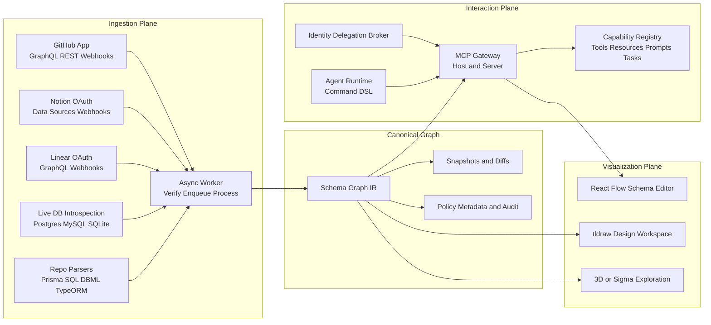
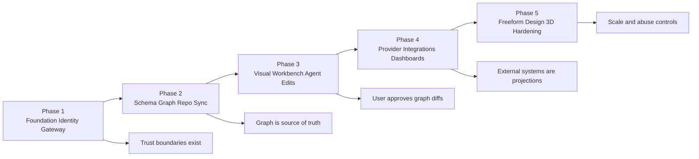
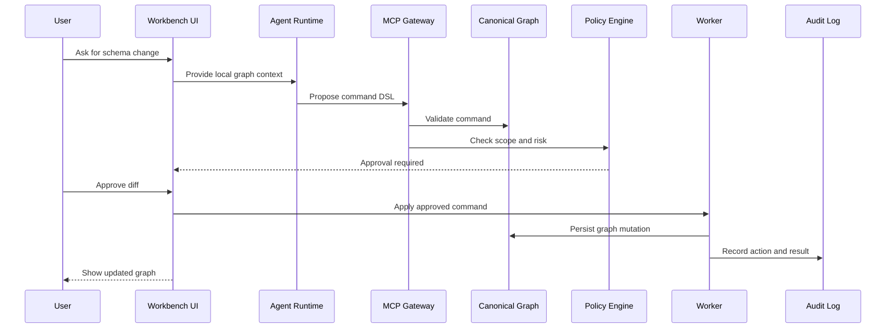

# Figma / FigJam Diagrams

FigJam board created in this session: https://www.figma.com/board/2riHSM7ahz9OoHRTrq7zUE

Diagrams added:

- Three-plane core architecture
- Identity delegation flow
- Implementation phases
- Guarded mutation flow
- Schema graph IR
- Close-call alternatives

The Mermaid source below is preserved so future agents can recreate or revise the diagrams if the connector loses access.

## Diagram 1: Three-Plane Core Architecture

## Diagram 2: Implementation Phases

## Diagram 3: Guarded Mutation Flow

